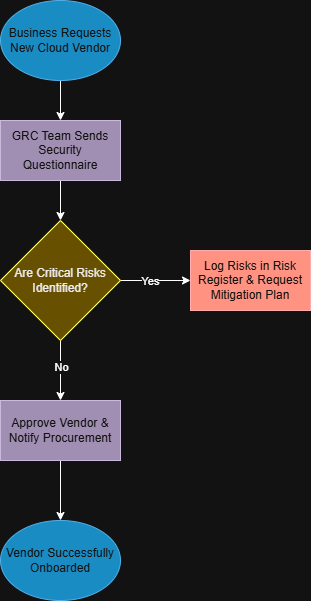

# Third-Party Risk Management (TPRM) Lifecycle Process

## Project Overview
This project outlines the end-to-end risk governance process for evaluating, onboarding, and monitoring third-party software vendors. This workflow ensures that external vendors comply with organizational security policies and do not introduce unmitigated risk into our environment.

## Vendor Risk Lifecycle Flowchart
Below is the color-coded workflow diagram mapping the assessment and escalation paths:

## Process Breakdown
1. **Intake & Triage (Neutral Blue):** The business requests a new tool, initiating the GRC review.
2. **Assessment (Calm Teal):** The GRC team gathers security documentation (SOC 2 reports, SIG questionnaires) to evaluate the vendor's security posture.
3. **Analysis (Warning Yellow):** A decision gate to determine if the vendor meets our risk threshold.
4. **Remediation (Alert Red):** If critical gaps are found, they are logged in the Risk Register, and a formal mitigation plan is required before moving forward.
5. **Approval & Monitoring (Neutral Blue):** Safe vendors are approved for procurement and scheduled for continuous annual reviews.